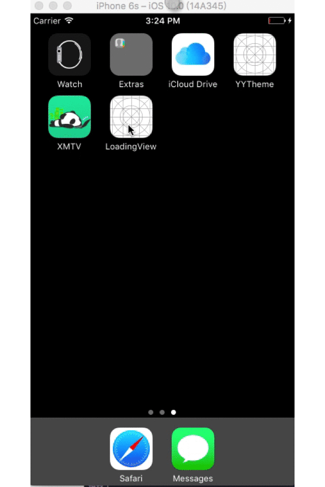
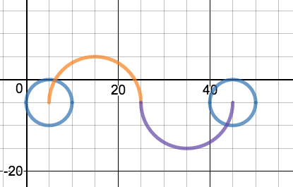

# LoadingView
加载动画


通过动画可以看出三个圆的交替运动，以及圆颜色的渐变，球的位置改变后它的颜色也和所在位置的球的颜色保持了一致。

动画解析：

- 1. 三个圆的大小相同每个圆的间隔是一个圆的大小
- 2. 运动轨迹是由两个半圆组成的，两个半月的圆心分别是(15,5).(35,5)直径是第一个圆心到第二圆的心的距离等于20。这里我们可以使用贝塞尔曲线来完成



```swift
let path1 = UIBezierPath.init()
//指定圆形的圆心和开始结束的角度   clockwise:是否顺时针
path1.addArc(withCenter: otherRoundCenter1, radius: 10, startAngle: -CGFloat(M_PI), endAngle: 0, clockwise: true)      
let path1_1 = UIBezierPath.init()
path1_1.addArc(withCenter: otherRoundCenter2, radius: 10, startAngle: -CGFloat(M_PI), endAngle: 0, clockwise: false)
//两段弧线拼接在一起
path1.append(path1_1)
```

我们把两个弧线拼接在一起就是球1的运行轨迹,球2和球3运行轨迹是一样的原理,都是一个半圆只不过圆心、开始角度和结束角度不同

```swift
//球二的轨迹
let path2 = UIBezierPath.init()
path2.addArc(withCenter: otherRoundCenter1, radius: 10, startAngle: 0, endAngle: -(CGFloat(M_PI)), clockwise: true)

//球三的轨迹
let path3 = UIBezierPath.init()
path3.addArc(withCenter: otherRoundCenter2, radius: 10, startAngle: 0, endAngle: -CGFloat(M_PI), clockwise: false)
```

知道了轨迹就可以让小球动起来

```swift
//position 告诉帧动画我们要改变它的位置
let anim = CAKeyframeAnimation.init(keyPath: "position")
//路径当然就是我们上面画的贝塞尔曲线啦
anim.path = path.cgPath
//完成后要不要移除
anim.isRemovedOnCompletion = false
//设置结束状态，一直保持结束的状态
anim.fillMode = kCAFillModeForwards
//让动画变得均匀
anim.calculationMode = kCAAnimationCubic
//重复的次数，统一定义就好
anim.repeatCount = animRepeatTime
//持续的时间
anim.duration = animTime
anim.delegate = self
//动画快慢，这里设置为缓进缓出
anim.timingFunction = CAMediaTimingFunction.init(name: kCAMediaTimingFunctionEaseInEaseOut)
//添加到圆1上
round1.layer.add(anim, forKey: "animation")
```